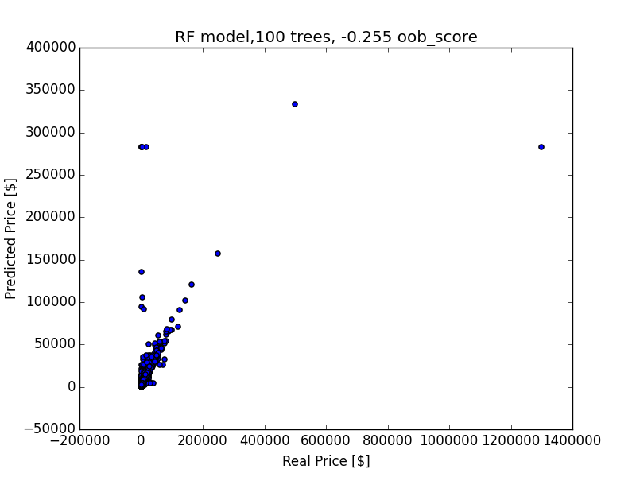
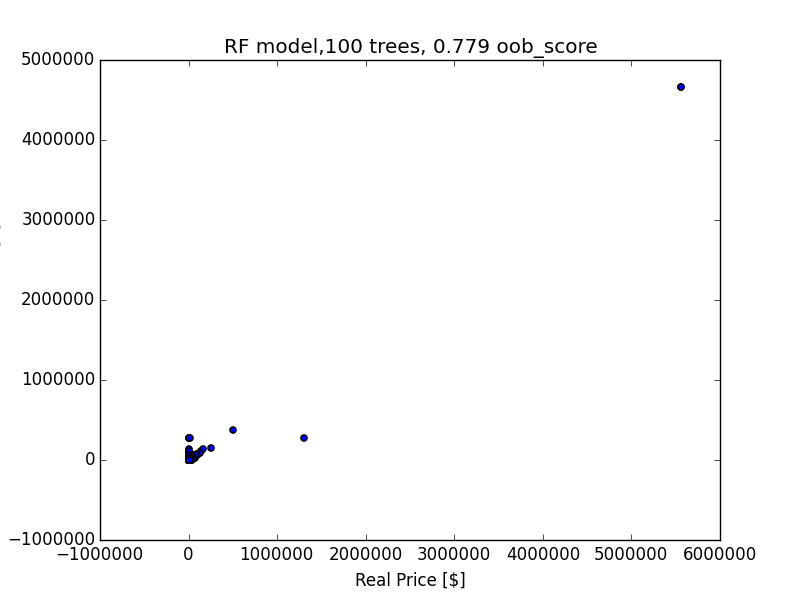

# Feature and Model Development Log-Book
### First Model
#####Features:
- Skills / Disciplines Dummy Variables
- Height (hh) as float (outlier removed, inches converted to hh
- Temperament as float
- Weigth (lbs) as float (outlier removed)
- Age as float (derived from Foal Date)
- Breed as Dummy Variables (no selection)
- Color as Dummy Variables (no selection)
- Sex as Dummy Variables (no selection)
- Pedigree is Dummy Variable

#####Model:
Sklearn's RandomForestRegressor
Parameters:
- n_estimators: 100
- max_features: auto
- oob_score: True

#####Sample Data:
R^2: 0.406
OOB: -0.255

#####All Data:
R^2: 0.952
OOB: 0.779

### Second Model
Remove Price Outliers

