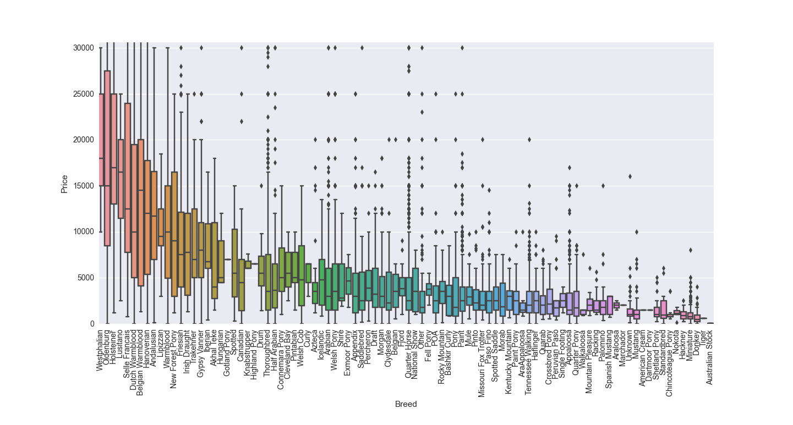
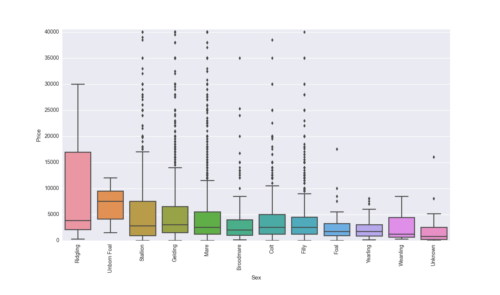
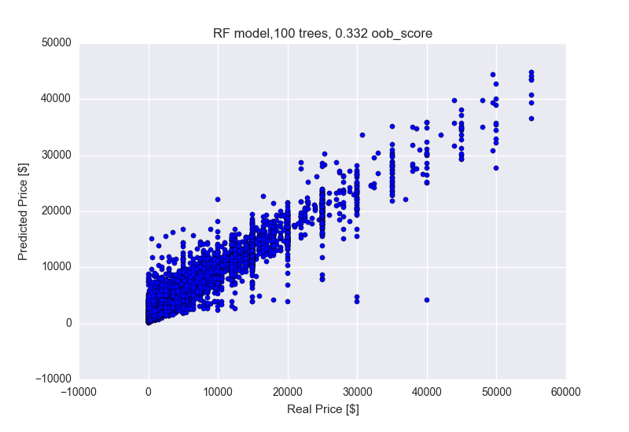

# Feature and Model Development Log-Book
### First Model
#####Features:
- Skills / Disciplines Dummy Variables
- Height (hh) as float (outlier removed, inches converted to hh
- Temperament as float
- Weigth (lbs) as float (outlier removed)
- Age as float (derived from Foal Date)
- Breed as Dummy Variables (no selection)
- Color as Dummy Variables (no selection)
- Sex as Dummy Variables (no selection)
- Pedigree is Dummy Variable

#####Model:
Sklearn's RandomForestRegressor

Parameters:

- n_estimators: 100
- max_features: auto
- oob_score: True

#####Sample Data:
R^2: 0.406
OOB: -0.255

#####All Data:
R^2: 0.952
OOB: 0.779

### Second Model
Remove Price Outliers (> 3*Std)
#####All Data:
R^2: 0.882
OOB: 0.288

### Tabular Feature Engineering
Breeds: Keep all except categories with single values.

Colors: Classify in Brindle, Grey, Piebald, Other

Sexes: Classify into Broodmare, Unborn Foal, Ridgling, Adult, Colt/Filly, Foal/Yearling

Temperament: Classify into Extreme vs Intermediate Temperament

Weight: Discard Weight

### Third Model
#####Features:
- Skills / Disciplines Dummy Variables (limited Skill set)
- Height (hh) as float (outlier removed, inches converted to hh)
- Temperament as dummy (extreme vs intermediate values)
- Age as float (derived from Foal Date)
- Breed as Dummy Variables (remove selected breeds)
- Color as Dummy Variables (reduced variable space)
- Sex as Dummy Variables (reduced variable space)
- Pedigree is Dummy Variable

#####Model:
Sklearn's RandomForestRegressor

Parameters:
- n_estimators: 100
- max_features: auto
- oob_score: True

#####All Data (prices < 60000):
R^2: 0.887
OOB: 0.332

