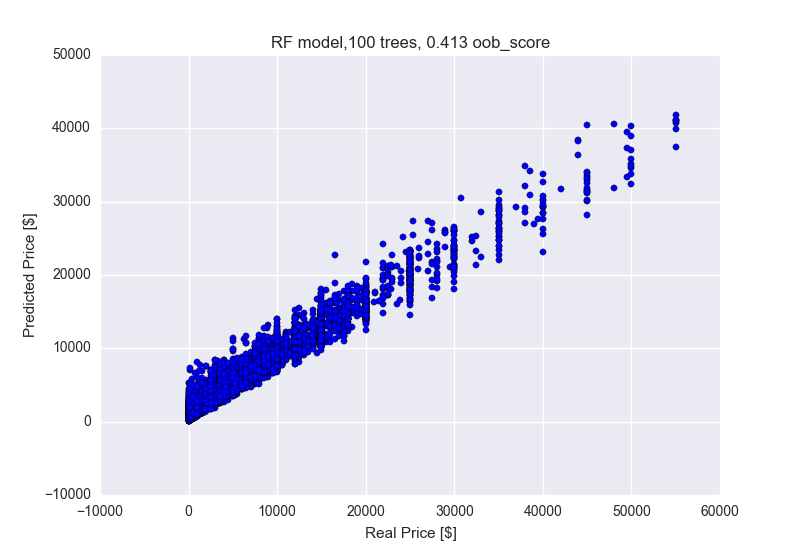
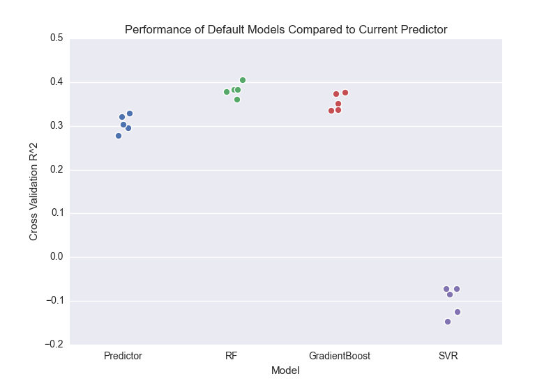

# Feature and Model Development Log-Book
This log book keeps track of the changes along the way of selecting and engineering features and models monitoring the effects of individual steps on the overall cross-validation R^2 score.
## Feature Optimization
### Version 0.0: The first running pipe.
#####Features:
- Skills / Disciplines as dummy variables
- Height (hh) as float
	- outliers removed
	- inches are identified through their unrealisticly high values and converted to hh
- Temperament as float
	- Range 0 - 1 
- Weigth (lbs) as float
	- outliers removed
- Age as float
	- derived from Foal Date
- Breed as dummy variables (no selection)
- Color as dummy variables (no selection)
- Sex as dummy variables (no selection)
- Pedigree is dummy variable

#####Fill Missing Values:
- Use most common value

#####Model:
Sklearn's RandomForestRegressor

- n_estimators: 100
- max_features: auto
- oob_score: True

#####Data:
- Subsample of the data

#####Scores:
- R^2 of the training data: 0.406
- OOB cross-validation R^2: -0.255

### Version 0.1: Include all data.
#####Change:
- Use all data

#####Scores:
- R^2 of the training data: 0.952
- OOB cross-validation R^2: 0.779

### Version 0.2: Remove target outliers.
#####Change:
- Remove price outliers (> 3*Std)

#####Scores:
- R^2 of the training data: 0.882
- OOB cross-validation R^2: 0.288

## EDA of Tabular Features
###Breeds:

#####Conclusion:
Keep all except categories with single values.
###Colors: 

#####Conclusion:
Classify in Brindle, Grey, Piebald, Other
###Sexes:

#####Conclusion:
Classify into Broodmare, Unborn Foal, Ridgling, Adult, Colt/Filly, Foal/Yearling
###Temperament:

#####Conclusion:
Classify into Extreme vs Intermediate Temperament
###Weight:

#####Conclusion:
Discard Weight

### Version 1.0: Reduce feature space
#####Change:
- Reduced variable space for Skills/Disciplines, Breed, Color, Sex
	- Map categories to subset of or new categories for Bred, Color, Sex
	- Discard categories with lower feature importance for Skills/Disciplines
- Extreme vs intermediate values for Temperament
- Remove weight
- Use only data with prices < $60,000

#####Scores:
- R^2 of the training data: 0.887
- OOB cross-validation R^2: 0.332

### Version 2.0: Add text data
#####Change:
- Skills/Disciplines merged with Descriptions
	- Vectorize into term-frequency matrix (TfidfVectorizer)
	- Parameters: strip_accents='unicode', stop_words='english', ngram_range=(1,2), min_df=100, use_idf=False 

#####Scores:
- R^2 of the training data: 0.918
- OOB cross-validation R^2: 0.413

### Version 2.1: Use inverse document frequency
#####Change:
- Use inverse document frequency
	- TfidfVectorizer Parameter: use_idf=True

#####Scores:
- R^2 of the training data: 0.920
- OOB cross-validation R^2: 0.422

### Version 3.0: Use topics from NMF
#####Change:
- Use TfidfVectorizer
	- Parameters: use_idf=False
	- Use internal tokenizer
- Extract 12 topics using NMF
	- Topic as single numeric column (topic id) 

#####Scores:
- R^2 of the training data: 0.705
- OOB cross-validation R^2: 0.224

### Version 3.1: Topic dummy variables
#####Change:
- Use dummy variables for topics

#####Scores:
- R^2 of the training data: 0.706
- OOB cross-validation R^2: 0.230

### Version 4.0: Use custom tokenizer
#####Change:
- Start from version 2.1
- Use nltk word_tokenizer and WordNetLemmatizer

#####Scores:
- R^2 of the training data: 0.916
- OOB cross-validation R^2: 0.400

### Version 4.1: Use selected vocabulary
#####Change:
- TFidfVectorizer: strip_accents='unicode',\
                          stop_words='english',\
                          ngram_range=(1, 1),\
                          min_df=100,\
                          tokenizer=self.tokenizer,\
                          vocabulary=Vocab,\
                          use_idf=True

#####Scores:
- R^2 of the training data: 0.917
- OOB cross-validation R^2: 0.398

## Change in code: separate processor/vectorizer
###Version 5.0:
#####Change:
- Temperament as float
- Fillna method: mode for categorical, mean for numeric

#####Scores:
- R^2 of the training data: 0.915
- OOB cross-validation R^2: 0.393

###Version 5.1:
#####Change:
- Samples only from prices in [150, 60000]

#####Scores:
- R^2 of the training data: 0.918
- OOB cross-validation R^2: 0.400

###Version 5.2:
#####Change:
- Change max_features in model to 'sqrt'
- MODEL_PARAMS = {'n_estimators': 100,
                'max_features': 'sqrt',
                'oob_score': True,
                'n_jobs': -1}
                
#####Scores:
- R^2 of the training data: 0.921
- OOB cross-validation R^2: 0.417

## Model optimization
### Current Random Forest Predictor against Default Models
- Use 5-fold cross-validation
- Default parameters for all models
- Current Predictor parameters: {'n_estimators': 100,
                'max_features': 'sqrt',
                'oob_score': True,
                'n_jobs': -1}

### Explore parameter space of other models
- Random Forest: {'n\_estimators': 100,
             'max\_features': 5,
             'oob\_score': True,
             'n\_jobs': -1}
- Gradient Boosting: {'loss': 'lad',
             'learning\_rate': 0.1,
             'n\_estimators': 100,
             'max\_depth': 3,
             'max\_features': 'sqrt',
             'alpha': 0.9}
- Support Vector Regressor: {'kernel': 'rbf',
              'C': 0.1,
              'epsilon': 0.1}

#####Changes:
- Random Forest: 'max\_features: 20
- Gradient Boosting: 'loss': 'huber'
- Support Vector Regressor: 'C': 0.5, 'epsilon': 0.2

#####Changes:
- Random Forest: 'n\_estimators': 200
- Gradient Boosting: 'learning\_rate': 0.05, 'n\_estimators': 200
- Support Vector Regressor: 'kernel': 'poly'

#####Changes:
- Gradient Boosting: 'loss': 'ls', 

#####Changes:
- Current Predictor: 'n\_estimators': 400

### Use maximum of KDE as predicted value in Predictor
    def predict(self, X):
        preds = self.predictions(X)
        p = []
        for row in preds.T:
            fig = plt.figure()
            graph = sns.kdeplot(row.ravel(), shade=True, color='g', alpha=1)
            x,y = graph.get_lines()[0].get_data()
            ind = np.argmax(y)
            price = np.round(x[ind], decimals=-1)
            p.append(price)
            plt.close(fig)
            graph = None
        return np.array(p)

### Use median predicted value in Predictor
    def predict(self, X):
        preds = self.predictions(X)
        return np.median(preds, axis=0)

