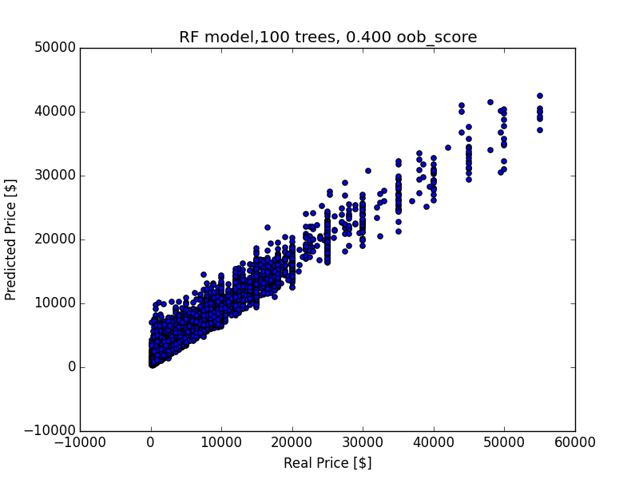

# Feature and Model Development Log-Book
## Feature optimization
### First Model
#####Features:
- Skills / Disciplines Dummy Variables
- Height (hh) as float (outlier removed, inches converted to hh
- Temperament as float
- Weigth (lbs) as float (outlier removed)
- Age as float (derived from Foal Date)
- Breed as Dummy Variables (no selection)
- Color as Dummy Variables (no selection)
- Sex as Dummy Variables (no selection)
- Pedigree is Dummy Variable

#####Model:
Sklearn's RandomForestRegressor

Parameters:

- n_estimators: 100
- max_features: auto
- oob_score: True

#####Sample Data:
R^2: 0.406
OOB: -0.255

#####All Data:
R^2: 0.952
OOB: 0.779

### Second Model
Remove Price Outliers (> 3*Std)
#####All Data:
R^2: 0.882
OOB: 0.288

### Tabular Feature Engineering
Breeds: Keep all except categories with single values.

Colors: Classify in Brindle, Grey, Piebald, Other

Sexes: Classify into Broodmare, Unborn Foal, Ridgling, Adult, Colt/Filly, Foal/Yearling

Temperament: Classify into Extreme vs Intermediate Temperament

Weight: Discard Weight

### Third Model
#####Features:
- Skills / Disciplines Dummy Variables (limited Skill set)
- Height (hh) as float (outlier removed, inches converted to hh)
- Temperament as dummy (extreme vs intermediate values)
- Age as float (derived from Foal Date)
- Breed as Dummy Variables (remove selected breeds)
- Color as Dummy Variables (reduced variable space)
- Sex as Dummy Variables (reduced variable space)
- Pedigree is Dummy Variable

#####Model:
Sklearn's RandomForestRegressor

Parameters:
- n_estimators: 100
- max_features: auto
- oob_score: True

#####All Data (prices < 60000):
R^2: 0.887
OOB: 0.332

### Fourth Model
#####Features:
- Skills / Disciplines merged with Descriptions, term-frequency matrix (strip_accents='unicode', stop_words='english', ngram_range=(1,2), min_df=100, use_idf=False)
- Height (hh) as float (outlier removed, inches converted to hh)
- Temperament as dummy (extreme vs intermediate values)
- Age as float (derived from Foal Date)
- Breed as Dummy Variables (remove selected breeds)
- Color as Dummy Variables (reduced variable space)
- Sex as Dummy Variables (reduced variable space)
- Pedigree is Dummy Variable

#####Model:
Sklearn's RandomForestRegressor

Parameters:
- n_estimators: 100
- max_features: auto
- oob_score: True

#####All Data (prices < 60000):
R^2: 0.918
OOB: 0.413

### Model 4a
Use inverse document frequency
#####Features:
- Skills / Disciplines merged with Descriptions, term-frequency matrix (strip_accents='unicode', stop_words='english', ngram_range=(1,2), min_df=100, use_idf=True)
- Height (hh) as float (outlier removed, inches converted to hh)
- Temperament as dummy (extreme vs intermediate values)
- Age as float (derived from Foal Date)
- Breed as Dummy Variables (remove selected breeds)
- Color as Dummy Variables (reduced variable space)
- Sex as Dummy Variables (reduced variable space)
- Pedigree is Dummy Variable

#####Model:
Sklearn's RandomForestRegressor

Parameters:
- n_estimators: 100
- max_features: auto
- oob_score: True

#####All Data (prices < 60000):
R^2: 0.920
OOB: 0.422

### Model 4b
Model 4a using own tokenizer (nltk word_tokenizer, WordNetLemmatizer)

#####All Data (prices < 60000):
R^2: 0.916
OOB: 0.400

### Fifth Model
#####Features:
- Skills / Disciplines merged with Descriptions, term-frequency matrix (strip_accents='unicode', stop_words='english', ngram_range=(1,2), min_df=100, use_idf=False), topic extraction using NMF (12 topics), topic as single numeric column
- Height (hh) as float (outlier removed, inches converted to hh)
- Temperament as dummy (extreme vs intermediate values)
- Age as float (derived from Foal Date)
- Breed as Dummy Variables (remove selected breeds)
- Color as Dummy Variables (reduced variable space)
- Sex as Dummy Variables (reduced variable space)
- Pedigree is Dummy Variable

#####Model:
Sklearn's RandomForestRegressor

Parameters:
- n_estimators: 100
- max_features: auto
- oob_score: True

#####Trained only on data with price (prices < 60000):
R^2: 0.705
OOB: 0.224

### Sixth Model
#####Features:
- Skills / Disciplines merged with Descriptions, term-frequency matrix (strip_accents='unicode', stop_words='english', ngram_range=(1,2), min_df=100, use_idf=False), topic extraction using NMF (12 topics), topic dummy variables
- Height (hh) as float (outlier removed, inches converted to hh)
- Temperament as dummy (extreme vs intermediate values)
- Age as float (derived from Foal Date)
- Breed as Dummy Variables (remove selected breeds)
- Color as Dummy Variables (reduced variable space)
- Sex as Dummy Variables (reduced variable space)
- Pedigree is Dummy Variable

#####Model:
Sklearn's RandomForestRegressor

Parameters:
- n_estimators: 100
- max_features: auto
- oob_score: True

#####Trained only on data with price (prices < 60000):
R^2: 0.706
OOB: 0.230

### Seventh Model
#####Features:
- Skills / Disciplines merged with Descriptions, term-frequency matrix 
- TFidfVectorizer: strip_accents='unicode',\
                          stop_words='english',\
                          ngram_range=(1, 1),\
                          min_df=100,\
                          tokenizer=self.tokenizer,\
                          vocabulary=Vocab,\
                          use_idf=True

- Height (hh) as float (outlier removed, inches converted to hh)
- Temperament as dummy (extreme vs intermediate values)
- Age as float (derived from Foal Date)
- Breed as Dummy Variables (remove selected breeds)
- Color as Dummy Variables (reduced variable space)
- Sex as Dummy Variables (reduced variable space)
- Pedigree is Dummy Variable

#####Model:
Sklearn's RandomForestRegressor

Parameters:
- n_estimators: 100
- max_features: auto
- oob_score: True

#####Trained only on data with price (prices < 60000):
R^2: 0.917
OOB: 0.398

## Change in code: separate processor/vectorizer
###Run I:
#####Data:
Only horses with price
#####Features:
- Skills / Disciplines merged with Descriptions, term-frequency matrix, use vocab
- TFidfVectorizer: strip_accents='unicode',\
                          stop_words='english',\
                          ngram_range=(1, 1),\
                          min_df=100,\
                          tokenizer=tokenizer,\
                          vocabulary=Vocab,\
                          use_idf=True
- tokenizer: WordNetLemmatizer()
- Height (hh) as float (outlier removed, inches converted to hh)
- Temperament as float
- Age as float (derived from Foal Date)
- Breed as Dummy Variables (according to dict)
- Color as Dummy Variables (reduced variable space)
- Sex as Dummy Variables (reduced variable space)
- Pedigree is Dummy Variable
- Fillna method: mode for categorical, mean for numeric
- PRICE_RANGE = [0, 60000]

#####Model:
Sklearn's RandomForestRegressor

Parameters:
- n_estimators: 100
- max_features: auto
- oob_score: True

#####Trained only on data with price (prices < 60000):
R^2: 0.915
OOB: 0.393

###Run II:
same as bevore, but
PRICE_RANGE = [150, 60000]
R^2: 0.918
OOB: 0.400

###Run III:
same as bevore, but

MODEL_PARAMS = {'n_estimators': 100,
                'max_features': 'sqrt',
                'oob_score': True,
                'n_jobs': -1}

R^2: 0.921
OOB: 0.417

## Model optimization
### Current Random Forest Predictor against Default Models
Use 5-fold cross-validation
Default parameters for all models
Predictor Parameter: MODEL_PARAMS = {'n_estimators': 100,
                'max_features': 'sqrt',
                'oob_score': True,
                'n_jobs': -1}

### Explore parameter space of other models
MODEL_PARAMS = {'n_estimators': 100,
                'max_features': 'sqrt',
                'oob_score': True,
                'n_jobs': -1}

RF_PARAMS = {'n_estimators': 100,
             'max_features': 5,
             'oob_score': True,
             'n_jobs': -1}

GB_PARAMS = {'loss': 'lad',
             'learning_rate': 0.1,
             'n_estimators': 100,
             'max_depth': 3,
             'max_features': 'sqrt',
             'alpha': 0.9}

SVR_PARAMS = {'kernel': 'rbf',
              'C': 0.1,
              'epsilon': 0.1}

MODEL_PARAMS = {'n_estimators': 100,
                'max_features': 'sqrt',
                'oob_score': True,
                'n_jobs': -1}

RF_PARAMS = {'n_estimators': 100,
             'max_features': 20,
             'oob_score': True,
             'n_jobs': -1}

GB_PARAMS = {'loss': 'huber',
             'learning_rate': 0.1,
             'n_estimators': 100,
             'max_depth': 3,
             'max_features': 'sqrt',
             'alpha': 0.9}

SVR_PARAMS = {'kernel': 'rbf',
              'C': 0.5,
              'epsilon': 0.2}

MODEL_PARAMS = {'n_estimators': 100,
                'max_features': 'sqrt',
                'oob_score': True,
                'n_jobs': -1}

RF_PARAMS = {'n_estimators': 200,
             'max_features': 20,
             'oob_score': True,
             'n_jobs': -1}

GB_PARAMS = {'loss': 'huber',
             'learning_rate': 0.05,
             'n_estimators': 200,
             'max_depth': 3,
             'max_features': 'sqrt',
             'alpha': 0.9}

SVR_PARAMS = {'kernel': 'poly',
              'C': 0.5,
              'epsilon': 0.2}

MODEL_PARAMS = {'n_estimators': 100,
                'max_features': 'sqrt',
                'oob_score': True,
                'n_jobs': -1}

RF_PARAMS = {'n_estimators': 200,
             'max_features': 20,
             'oob_score': True,
             'n_jobs': -1}

GB_PARAMS = {'loss': 'ls',
             'learning_rate': 0.05,
             'n_estimators': 200,
             'max_depth': 3,
             'max_features': 'sqrt',
             'alpha': 0.9}

SVR_PARAMS = {'kernel': 'poly',
              'C': 0.5,
              'epsilon': 0.2}

MODEL_PARAMS = {'n_estimators': 400,
                'max_features': 'sqrt',
                'oob_score': True,
                'n_jobs': -1}

RF_PARAMS = {'n_estimators': 200,
             'max_features': 20,
             'oob_score': True,
             'n_jobs': -1}

GB_PARAMS = {'loss': 'ls',
             'learning_rate': 0.05,
             'n_estimators': 200,
             'max_depth': 3,
             'max_features': 'sqrt',
             'alpha': 0.9}

SVR_PARAMS = {'kernel': 'poly',
              'C': 0.5,
              'epsilon': 0.2}

### Use maximum of KDE as predicted value in Predictor
    def predict(self, X):
        preds = self.predictions(X)
        p = []
        for row in preds.T:
            fig = plt.figure()
            graph = sns.kdeplot(row.ravel(), shade=True, color='g', alpha=1)
            x,y = graph.get_lines()[0].get_data()
            ind = np.argmax(y)
            price = np.round(x[ind], decimals=-1)
            p.append(price)
            plt.close(fig)
            graph = None
        return np.array(p)

### Use median predicted value in Predictor
    def predict(self, X):
        preds = self.predictions(X)
        return np.median(preds, axis=0)

