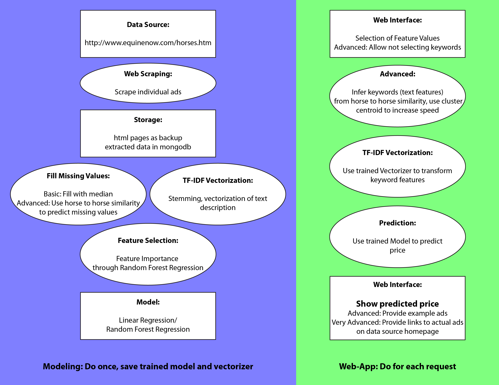

#PriceYourHorse: Determine The Price Tag

###AUTHOR:
Sandra Guetg, 11/01/2015
###SUMMARY:
PriceYourHorse simplifies the life of non-commercial horse buyers and sellers. No need to search manually through hundreds of ads to get a sense of the usual price range, just select the features of your animal and get a price estimate based on thousands of ads.
Under the hood, PriceYourHorse relys on a regression model based on thousands of ads scraped from [www.equinenow.com](http://www.equinenow.com/horses.htm). Features from tabular, mostly categorical information as well as from the text description are selected based on feature importance and used to fit the final regression model. Missing values in the dataset are derived from the ensembled data set. The final trained model as well as the trained TF-IDF Vectorizer required to transform keyword features are saved for rapid availability in a web-application. The PriceYourHorse web-application allows the user to select values for all the important features previously identified and predicts a price based on the underlying trained model, which is subsequently presented to the user together with his or her feature value selection.

###PRESENTATION:
PriceYourHorse will be accessible through a web-browser interface. The start page will introduce the user to the concept and briefly describe the context of the project. It will include a link to the main page that serves as interface between the user and the application. Running the application will result in displaying another page containing the predicted price, the selected features as well as a link to return to the main page. In an advanced version, the main page will have the previously selected features preselected at this stage. A third page will present the author. Optionally, a fourth page will contain a more detailed description of the application as well as selected benchmark parameters.
During the 3 minute presentation at hiring day, these pages will be shown on slides. Furthermore, the under the hood processes as well as major findings in feature selection will be presented on slides.

###DATA SOURCE:
The required data is scraped from [www.equinenow.com](http://www.equinenow.com/horses.htm), leading to a dataset of several thousand advertisements covering diverse breeds, ages, disciplines and educational levels of the horses. All advertisement pages are saved as whole html files on disk for backup purposes. Feature data is extracted from the advertisements and stored in mongodb. Processed data is stored at several stages in binary format to reduce development time.
80'290 advertisements are already stored on disk, however, not all of these contain price information (no price indicated if the horse had already been sold). These advertisements are used to enrich the dataset used to fill missing values in the training dataset for the model. The code required to update the data taking into account more recent advertisements is availabe.

###BUILDING BLOCKS:
#####General Software Design:
The modeling part will predominantly be function based, with the exception of objects already present in diverse libraries, paired with storage of the data at intermediate steps on disk. This allows for more independent development of the individual steps, since storing data in objects interferes with flexibly updating the corresponding class. The individual functions or modules will follow predefined input and output contracts, while the function body is easily changed for different or more advanced options. Initially, the most basic approach allowing for functionality will be implemented. Depending on time availability, these functions will be updated later for improved functionality.
The web application part might or might not be implemented in an object-oriented manner, depending on the requirements of the framework. This framework will be covered during class next week, such that a decision will be made prior to the start of the project. Here, an object oriented approach would be more elegant and show corresponding skills. Also, this part requires less flexibility because it requires no exploratory data analyses and no storage of intermediary processed data.
Data handling will be performed using pandas dataframes throughout the analyses. 
#####Web Scraping:
The code for basic web scraping has already been developed. As a first step, it loops through all the advertisement summary pages and collects the links leading to the detailed advertisement pages containing the required feature information. All links from batches of 100 pages are saved on disk and merged later into a single linklist. This approach was choosen after observing failure of the script due to connection issues. The serial nature of the script lead to loss of significant scraping time in such cases. Second, the program loops through all the links, scraping the detailed information of the advertisements and saving the advertisement page as a whole on disk as well as the relevant extracted information into a mongodb database. An update function allows integrating new data from advertisements not yet contained in the linklist.
Experience with this technique as well as new input from class resulted in developing a parallelized version improoving speed as well as minimizing the time gap between scraping the link and scraping the detailed information, and thus minimizing data loss through deletion of the advertisement page during this time. This version has not been tested yet.
Also, information extraction into the mongodb database needs to be repeted due to now known issues with the extraction of price information.
#####Fill Missing Values:
In the basic version, missing values will be filled with the most common category among samples (categorical data) or the median of all samples. In an advanced version, horse to horse similarity will be employed to estimate missing values. Categorical data will be transformed into dummy variables and weights will be applied to not overweight the influence of these variables. As a first approach, euclidean distance will be used to score similarity. Alternatively, a costum made similarity score based on same versus different category might be employed, given that most features are categorical. Pair-wise similarity will be calculated based on values present in both samples and missing values will be estimated based on the k most similar samples.
#####Vectorization of Text Description:
The text description of the horses will be treated separatly from other features. Using sklearn's TfidfVectorizer, it will be transformed into processable features and then reunited with other features for feature selection.
#####Feature Selection:
Initial feature selection will be performed using the feature importance score of sklearns RandomForestRegressor. For a more advanced setting, collinearity of the features will be explored and linear regression models (statsmodels OLS) will be employed to further investigate the feature space and decide on relevant features. This step benefits heavily from exploratory data analysis, such that significant improvements might be achieved over the initial basic selection when updating this step. Potentially, keyword selection from the vectorized text descriptions will be performed independently of the remaining features.
#####Model:
Price prediction will be based on a regression model. Depending on performance, a Linear Regression model or a Random Forest Regression model will be choosen. Initially, a Random Forest Regression model will be implemented since this enables easy handling of categorical variables. This will later be compared to sklearn's LinearRegression using dummy variables for the categorical data. The final, trained model will be saved for later use in the web-application.
#####Web Interface:
The web interface of the application will be produced using Flask. The interface itself will be surrounded by static pages for a more complete appearance, and a modern look will be achieved using publicly available templates. The exact details of the implementation are yet to be determined.
###STEPs:
The next step will be to update the data collection and re-run the information extraction from the html pages to correct for mis-assignments of some of the prices. Then, an initial version of the function to predict missing values and an initial version of the regression model will be implemented, leading to a functional preliminary version of the predictor. At this stage, text description data will not be considered yet. Following this step, an preliminary but functional version of the web-interface will be set up. Next, text description data will be added to the model, and initial feature selection will be performed, providing the basic version of the predictor. Subsequently, the web-interface will be updated to a basic version including static description and author information pages and improved style using  a template. The function to predict missing values will be updated and further feature selection will be performed. Finally, the web-interface will be adjusted to the final feature selection. I anticipate to take the project this far in the allocated time. In case of time shortage, I will cut back on optimizing feature selection and, if necessary, on updating the predict missing values function. In case of left over time, I will polish the web-interface or, if there is a lot, I will implement an automatic key word selection based on horse to horse similarity allowing the user to not select any keywords without implicitly selecting the absence of these keywords.
###ANTICIPATED PROBLEMS:
Given that the data is largely present on disk, no major problems are anticipated. However, it is currently uncertain whether there will be issues with designing the web-interface, since these skills are still to be acquired. These potential problems will be addressed through implementing a preliminary version of the web-interface very early in the process, allowing for time to troubleshoot and searching for solutions in the internet.
###EXTERNAL TOOLS:
External tools that will be used for this project encompass mostly python libraries, for instance numpy, pandas, statsmodels, sklearn, matplotlib and math. The exact selection is yet to be determined. Furthermore, mongoDB and Flask will be used, as well as some style template for the web-interface. These tools will be indicated on the start page of the web-interface and acknowledged during the presentation.